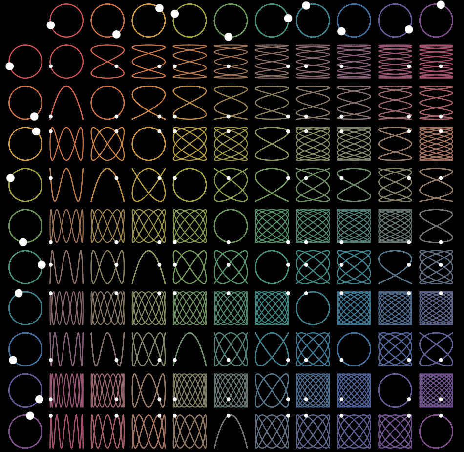

# Lissajous Table

A single-file, dependency-free HTML animation of a Lissajous table: an 11×11 grid in which
every cell traces the curve produced by pairing one oscillator's horizontal motion with
another's vertical motion.



## Background

If you drive a point horizontally by one sine wave and vertically by another, the path it
traces depends almost entirely on the ratio between the two frequencies. Equal frequencies
give a circle or an ellipse. A 2:1 ratio gives a parabola or a figure eight. A 9:7 ratio gives
a dense woven mesh that takes nine full horizontal oscillations to close on itself. These
paths are Lissajous curves.

The American mathematician Nathaniel Bowditch described them first, in 1815, while studying
the motion of a compound pendulum — which is why they are sometimes called Bowditch curves.
They are named, though, for the French physicist Jules Antoine Lissajous, who arrived at them
independently in 1857 by a much more theatrical route. He mounted small mirrors on the prongs
of two tuning forks set at right angles, bounced a beam of light off one mirror and then the
other, and threw the result onto a screen. The audience saw a stable glowing figure whose shape
depended on how the two forks were tuned. Detune one slightly and the figure would drift and
tumble, because a small frequency mismatch shows up as a slowly rotating phase difference. It
was a way of *seeing* a musical interval.

The technique turned out to be far more than a lecture demonstration. Before electronic
frequency counters existed, comparing an unknown oscillator against a reference one on an
oscilloscope in X–Y mode was a standard way to measure frequency and phase: you adjusted until
the figure stopped moving, then read the ratio off the number of lobes. The same curves drove
the Victorian craze for the harmonograph, a table-sized instrument of swinging pendulums and a
pen that drew the figures onto paper.

The **table** arrangement is a later, purely pedagogical idea, and it is the thing this repository
draws. Instead of showing one curve at a time, it lays out a grid: the top row and the left
column each hold a reference oscillator, running at 1×, 2×, 3× and so on up to 10× a base
frequency, drawn as a circle with a dot going round it. Every interior cell then belongs to one
row and one column, and shows what you get when you combine that pair. The whole family is
visible at once, and the structure of the family becomes obvious in a way it never is from a
single curve.

A few things worth watching for in the grid:

- **The diagonal is all circles.** Those are the 1:1 cells, where a cell's row and column
  oscillator are the same one.
- **Every 2:1 ratio is a parabola** — cells (2,1), (4,2), (6,3), (8,4) and (10,5). Cells sharing a
  reduced frequency ratio trace the identical shape, so the grid quietly repeats itself along
  diagonal lines.
- **Curves get denser away from the diagonal**, because the further apart the two frequencies
  are, the longer the path has to wander before it closes.
- **The dots never lose sync.** Each dot's horizontal position is copied from the circle at the
  top of its column and its vertical position from the circle at the left of its row, so the
  entire table is driven by just ten numbers.

## What this simulation does

`lissajousTable.html` renders the table on an HTML5 canvas, sized to a square that fills as much
of the browser window as it can. It has no build step, no dependencies and no network calls —
open the file and it runs.

Cell *(i, j)* traces the parametric curve

```
x = sin(j · t)
y = cos(i · t)
```

with row 0 and column 0 falling back to their own index on both axes, which is what makes them
circles. The sine/cosine pairing (rather than sine/sine) is what puts a quarter-turn of phase
between the two axes, and it is the reason the diagonal comes out as circles rather than
straight lines.

Because every cell shares the same parameter `t`, the entire table closes at `t = 2π` — roughly
6.2 seconds at normal speed. On load the animation uses this: it starts with an empty canvas and
draws the curves in progressively, each white dot riding the head of its own growing line. The
slow cells are still sketching a single arc while the fast ones have already woven themselves
into solid blocks. Once the cycle completes, the curves are finished and the dots keep looping
over them indefinitely.

Pressing space clears the canvas and starts the drawing-in pass over, because that opening
sequence and the finished loop are two quite different things to look at.

### Controls

There is no on-screen interface beyond a hint that fades out after three seconds. Everything is
on the keyboard.

| Key | Action |
| --- | --- |
| <kbd>↑</kbd> or <kbd>→</kbd> | Speed up by 0.1× |
| <kbd>↓</kbd> or <kbd>←</kbd> | Slow down by 0.1× |
| <kbd>Esc</kbd> | Freeze everything in place, or release it again |
| <kbd>Space</kbd> | Clear the canvas and draw the table again from nothing |

Speed runs from −4× to 4×. It passes through zero, so holding the down arrow will freeze the
table and then run it backwards. The speed keys work during the drawing-in pass too, which is
worth trying: slowed right down, you can follow a single cell as it weaves itself.

<kbd>Esc</kbd> pauses without touching the speed, so releasing it picks up exactly where it left
off. It is the key to reach for when you want to study the frozen table: with the dots held
still, you can read each one's position off the circle at the top of its column and the circle at
the left of its row, and see for yourself that the whole grid is driven by only ten numbers. It
works mid-draw too, which stops the table half-finished. <kbd>Space</kbd> always releases the
pause, since otherwise it would clear the canvas and leave you staring at nothing.

A small readout shows the current speed while you adjust it, then fades. Resizing the window
re-renders at the new size and keeps whatever progress the drawing-in pass had made.

## Implementation notes

The finished curves are stroked onto an offscreen canvas rather than redrawn every frame. During
the drawing-in pass only the arc covered since the previous frame is appended, so the cost per
frame stays flat no matter how much has already been drawn. Once the table is complete, each
frame is a single `drawImage` of that layer plus 120 filled circles for the dots, which is cheap
enough to stay smooth at 4× on modest hardware. The canvas is scaled by device pixel ratio so
the thin strokes stay crisp on high-density displays.

The geometry and the palette were reverse-engineered from a recording of the original animation.
Amplitude is 40% of the cell size; the ten oscillator colours are stored as RGB triples in the
`PALETTE` array, and every interior cell's colour is the plain RGB average of its row and column
colours — which is why row 1 shifts toward magenta as it approaches column 10, rather than
passing through green the way an averaged *hue* would.

## License

MIT — see [LICENSE](LICENSE).
